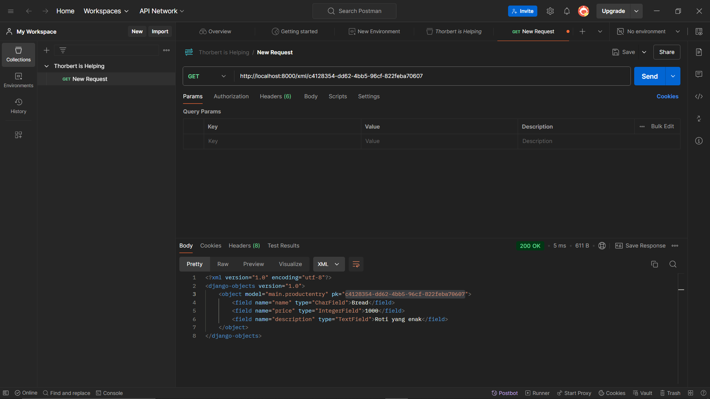
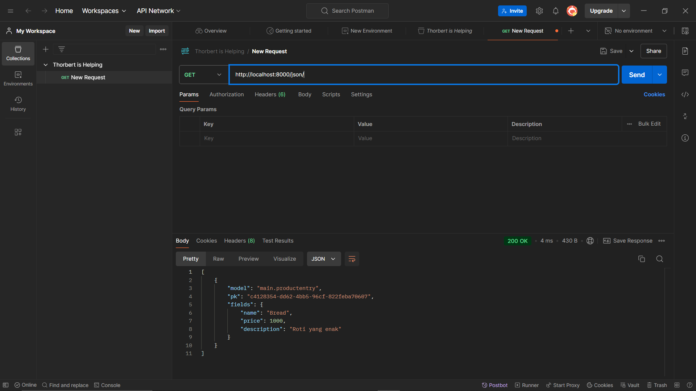
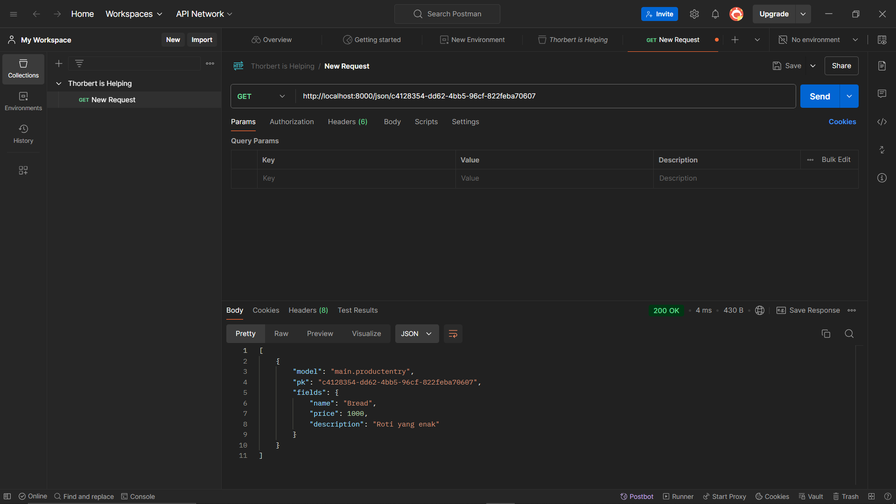

# Shippy
Ecommerce Shippy, giving you an experience to throw away your money.

## Tugas 2
#### 1. Jelaskan bagaimana cara kamu mengimplementasikan checklist di atas secara step-by-step (bukan hanya sekadar mengikuti tutorial).
- Membuat github repo shippy dan melakukan clone ke dalam local directory saya
- Membuat envriontment dan membuat requirements untuk menginstall resource yang dibutuhkan
- Membuat proyek awal Django dengan startproject dan kemudian menambahkan gitignore
- Membuat aplikasi main dan melakukan beberapa penyesuaian seperti pada direktori luar bagian settings.py dengan menambahkan host yang diperbolehkan untuk pws dan local host, menambahkan main pada installed app, dan menghubungkan url aplikasi main ke urls.py
- Adapun penyesuaian yang dilakukan pada direktori aplikasi main seperti menambahkan templates (html, disini saya memakai tailwind untuk mempercantiknya), menambahkan model dan melakukan migrate, menambahakan render code dibagian view,dan terakhir menambahkan path render di urls.py.
- Terakhir tinggal di coba runserver untuk memastikan semua berjalan aman dan melakukan push di pws.

#### 2. Buatlah bagan yang berisi request client ke web aplikasi berbasis Django beserta responnya dan jelaskan pada bagan tersebut kaitan antara urls.py, views.py, models.py, dan berkas html.

#### 3. Jelaskan fungsi git dalam pengembangan perangkat lunak!

Git berfungsi sebagai sistem kontrol versi yang berarti ia menyimpan riwayat perubahan atau versi dari sebuah proyek. Fitur ini memudahkan programmer untuk kembali ke versi sebelumnya jika diperlukan, dan sangat berguna untuk kolaborasi tim. Dengan Git, setiap anggota tim dapat bekerja pada bagian yang berbeda dari proyek secara paralel tanpa saling mengganggu, serta dapat menggabungkan perubahan mereka dengan mudah.

#### 4. Menurut Anda, dari semua framework yang ada, mengapa framework Django dijadikan permulaan pembelajaran pengembangan perangkat lunak?

Menurut saya, keramahan pemula menggunakan Django merupakan poin utama. Django membawa banyak sekali fitur bawaan dibandingkan framework lainnya, sehingga programmer hanya perlu memakai fitur tersebut untuk membuat sebuah website dengan cepat. Fitur-fitur seperti ORM (Object-Relational Mapping) dan routing URL sudah disediakan secara default, yang memudahkan pemula dalam membangun aplikasi tanpa harus mengonfigurasi banyak hal dari awal.

Ditambah dengan bahasa pemrograman yang digunakan adalah Python, yang juga dipakai di DDP1 dan terkenal ramah pemula, hal ini membuat Django menjadi framework yang sangat ideal bagi mereka yang baru memulai. Python memiliki sintaks yang sederhana dan intuitif, sehingga membantu pemula fokus pada konsep pengembangan tanpa terbebani oleh kompleksitas bahasa. Selain itu, Django juga terstruktur dengan baik, menggunakan pola *Model-View-Template (MVT)*, yang membantu programmer memahami dan mengelola proyek dengan lebih mudah dan teratur.

#### 5. Mengapa model pada Django disebut sebagai ORM?

Model pada Django disebut sebagai ORM (Object-Relational Mapping) karena memungkinkan pemetaan objek Python langsung ke tabel database, sehingga kita bisa mengelola database tanpa menulis query SQL manual. ORM memudahkan pengembang untuk melakukan operasi seperti membuat, membaca, memperbarui, dan menghapus data (CRUD) langsung dengan kode Python. Django juga otomatis menangani relasi antar-tabel, sehingga pengelolaan database lebih efisien dan terstruktur.

## Tugas 3
#### 1. Jelaskan mengapa kita memerlukan data delivery dalam pengimplementasian sebuah platform?

Data delivery adalah proses pengiriman data antar komponen sistem. Implementasi yang efisien sangat penting agar komponen-komponen dalam sistem dapat saling berbagi data dengan lancar. Banyak fitur dalam pengembangan software yang bergantung pada proses ini, karena data delivery memastikan komunikasi yang tepat waktu, sinkronisasi sistem, serta pengalaman pengguna yang optimal. 

#### 2. Menurutmu, mana yang lebih baik antara XML dan JSON? Mengapa JSON lebih populer dibandingkan XML?

Menurut saya, JSON lebih baik dibandingkan XML karena memiliki sintaks yang lebih sederhana dan lebih mudah dibaca. JSON menggunakan struktur list, sementara XML menggunakan tag pembuka dan penutup untuk objek-objeknya. Selain itu, JSON lebih cepat dan efisien dalam pemrosesan data dibandingkan XML karena hanya melakukan parsing saja untuk mengambil datanya. JSON juga lebih mudah diintegrasikan dengan API modern dan framework berbasis web. Hal ini menjelaskan mengapa JSON lebih populer dibandingkan XML, karena memberikan kemudahan dan performa yang lebih baik dalam menyimpan dan bertukar data.

#### 3. Jelaskan fungsi dari method is_valid() pada form Django dan mengapa kita membutuhkan method tersebut?

Method is_valid() pada form Django berfungsi untuk memastikan bahwa data yang dimasukkan ke dalam form memenuhi semua kriteria validasi yang telah ditetapkan. Method ini memeriksa apakah setiap field sesuai seperti formatnya dan nilai yang diperlukan. Method ini akan mengembalikan True jika persyaratan tadi dipenuhi dan sebaliknya False jika ada kesalahan. Dengan menggunakan is_valid(), kita dapat memastikan bahwa hanya data yang valid yang diproses atau disimpan nantinya.

#### 4. Mengapa kita membutuhkan csrf_token saat membuat form di Django? Apa yang dapat terjadi jika kita tidak menambahkan csrf_token pada form Django? Bagaimana hal tersebut dapat dimanfaatkan oleh penyerang?

CSRF token berfungsi untuk melindungi dari serangan CSRF (Cross-Site Request Forgery), di mana penyerang memanfaatkan autentikasi pengguna untuk melakukan tindakan berbahaya. Serangan ini dimulai ketika pengguna login ke suatu situs web dan informasi autentikasi disimpan dalam cookie. Penyerang kemudian mengirimkan link berbahaya melalui email atau chat. Jika pengguna mengklik link tersebut tanpa adanya proteksi CSRF, penyerang dapat melakukan tindakan yang merugikan karena pengguna sudah terautentikasi oleh cookie. Namun, dengan adanya CSRF token, server akan memverifikasi token yang dikirim bersama permintaan. Jika tidak ada CSRF token atau tokennya tidak valid, server akan menolak permintaan tersebut dengan memberikan error 403, sehingga serangan dapat dicegah.

#### 5. Jelaskan bagaimana cara kamu mengimplementasikan checklist di atas secara step-by-step (bukan hanya sekadar mengikuti tutorial).

- Langkah pertama, saya membuat file forms.py yang berisi definisi form untuk input data. Di sini, saya menggunakan model dari tugas sebelumnya dengan field yang diperlukan, yaitu name, price, dan description, dan saya membuat ProductForm berdasarkan model tersebut.

- Setelah itu, saya membuat sebuah fungsi di views.py bernama make_entry_product untuk menangani pembuatan form. Fungsi ini akan mengelola logika pengiriman form (POST) dan validasi form.

- Selanjutnya, saya membuat sebuah halaman HTML di dalam direktori templates untuk menampilkan form. HTML ini digunakan untuk menerima input dari pengguna dan mengirimkan data menggunakan metode POST.

- Pada fungsi make_entry_product, saya menangani dua kondisi. Jika request.POST kosong (artinya pengguna belum mengirimkan data), maka saya akan merender halaman main.html dengan form kosong. Jika request.POST berisi data (artinya pengguna telah mengirimkan form), maka saya memeriksa validitas form menggunakan form.is_valid(). Jika form valid, saya menyimpan data tersebut ke database dengan form.save() dan mengarahkan pengguna kembali ke main.html.

- Kemudian saya memastikan routing yang benar diatur di urls.py, sehingga ketika pengguna mengakses URL tertentu, mereka diarahkan ke fungsi make_entry_product dan form dapat ditampilkan atau diproses

- Sisanya saya lakukan dengan membuat fungsi pada views.py untuk tiap format data delivery. Disini saya memanfaatkan serializer untuk mengubah data ProductEntry menjadi format XML/JSON (bisa juga by id, disini saya pakai filter buat yang id) Setelahnya saya return dalam bentuk HttpResponse yang sudah di serialize kan.

- Terakhir, saya tambahkan semuanya di urls.py (masing-masing pathnya)

## POSTMAN SCREENSHOT

