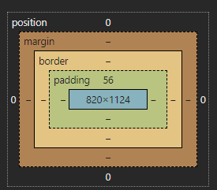

# Shippy
Ecommerce Shippy, giving you an experience to throw away your money.
<details open>
<summary> Tugas 2 </summary>
## Tugas 2
#### 1. Jelaskan bagaimana cara kamu mengimplementasikan checklist di atas secara step-by-step (bukan hanya sekadar mengikuti tutorial).
- Membuat github repo shippy dan melakukan clone ke dalam local directory saya
- Membuat envriontment dan membuat requirements untuk menginstall resource yang dibutuhkan
- Membuat proyek awal Django dengan startproject dan kemudian menambahkan gitignore
- Membuat aplikasi main dan melakukan beberapa penyesuaian seperti pada direktori luar bagian settings.py dengan menambahkan host yang diperbolehkan untuk pws dan local host, menambahkan main pada installed app, dan menghubungkan url aplikasi main ke urls.py
- Adapun penyesuaian yang dilakukan pada direktori aplikasi main seperti menambahkan templates (html, disini saya memakai tailwind untuk mempercantiknya), menambahkan model dan melakukan migrate, menambahakan render code dibagian view,dan terakhir menambahkan path render di urls.py.
- Terakhir tinggal di coba runserver untuk memastikan semua berjalan aman dan melakukan push di pws.

#### 2. Buatlah bagan yang berisi request client ke web aplikasi berbasis Django beserta responnya dan jelaskan pada bagan tersebut kaitan antara urls.py, views.py, models.py, dan berkas html.


#### 3. Jelaskan fungsi git dalam pengembangan perangkat lunak!

Git berfungsi sebagai sistem kontrol versi yang berarti ia menyimpan riwayat perubahan atau versi dari sebuah proyek. Fitur ini memudahkan programmer untuk kembali ke versi sebelumnya jika diperlukan, dan sangat berguna untuk kolaborasi tim. Dengan Git, setiap anggota tim dapat bekerja pada bagian yang berbeda dari proyek secara paralel tanpa saling mengganggu, serta dapat menggabungkan perubahan mereka dengan mudah.


#### 4. Menurut Anda, dari semua framework yang ada, mengapa framework Django dijadikan permulaan pembelajaran pengembangan perangkat lunak?

Menurut saya, keramahan pemula menggunakan Django merupakan poin utama. Django membawa banyak sekali fitur bawaan dibandingkan framework lainnya, sehingga programmer hanya perlu memakai fitur tersebut untuk membuat sebuah website dengan cepat. Fitur-fitur seperti ORM (Object-Relational Mapping) dan routing URL sudah disediakan secara default, yang memudahkan pemula dalam membangun aplikasi tanpa harus mengonfigurasi banyak hal dari awal.

Ditambah dengan bahasa pemrograman yang digunakan adalah Python, yang juga dipakai di DDP1 dan terkenal ramah pemula, hal ini membuat Django menjadi framework yang sangat ideal bagi mereka yang baru memulai. Python memiliki sintaks yang sederhana dan intuitif, sehingga membantu pemula fokus pada konsep pengembangan tanpa terbebani oleh kompleksitas bahasa. Selain itu, Django juga terstruktur dengan baik, menggunakan pola *Model-View-Template (MVT)*, yang membantu programmer memahami dan mengelola proyek dengan lebih mudah dan teratur.

#### 5. Mengapa model pada Django disebut sebagai ORM?

Model pada Django disebut sebagai ORM (Object-Relational Mapping) karena memungkinkan pemetaan objek Python langsung ke tabel database, sehingga kita bisa mengelola database tanpa menulis query SQL manual. ORM memudahkan pengembang untuk melakukan operasi seperti membuat, membaca, memperbarui, dan menghapus data (CRUD) langsung dengan kode Python. Django juga otomatis menangani relasi antar-tabel, sehingga pengelolaan database lebih efisien dan terstruktur.

</details>

<details open>
<summary> Tugas 3 </summary>
## Tugas 3
#### 1. Jelaskan mengapa kita memerlukan data delivery dalam pengimplementasian sebuah platform?

Data delivery adalah proses pengiriman data antar komponen sistem. Implementasi yang efisien sangat penting agar komponen-komponen dalam sistem dapat saling berbagi data dengan lancar. Banyak fitur dalam pengembangan software yang bergantung pada proses ini, karena data delivery memastikan komunikasi yang tepat waktu, sinkronisasi sistem, serta pengalaman pengguna yang optimal. 

#### 2. Menurutmu, mana yang lebih baik antara XML dan JSON? Mengapa JSON lebih populer dibandingkan XML?

Menurut saya, JSON lebih baik dibandingkan XML karena memiliki sintaks yang lebih sederhana dan lebih mudah dibaca. JSON menggunakan struktur list, sementara XML menggunakan tag pembuka dan penutup untuk objek-objeknya. Selain itu, JSON lebih cepat dan efisien dalam pemrosesan data dibandingkan XML karena hanya melakukan parsing saja untuk mengambil datanya. JSON juga lebih mudah diintegrasikan dengan API modern dan framework berbasis web. Hal ini menjelaskan mengapa JSON lebih populer dibandingkan XML, karena memberikan kemudahan dan performa yang lebih baik dalam menyimpan dan bertukar data.

#### 3. Jelaskan fungsi dari method is_valid() pada form Django dan mengapa kita membutuhkan method tersebut?

Method is_valid() pada form Django berfungsi untuk memastikan bahwa data yang dimasukkan ke dalam form memenuhi semua kriteria validasi yang telah ditetapkan. Method ini memeriksa apakah setiap field sesuai seperti formatnya dan nilai yang diperlukan. Method ini akan mengembalikan True jika persyaratan tadi dipenuhi dan sebaliknya False jika ada kesalahan. Dengan menggunakan is_valid(), kita dapat memastikan bahwa hanya data yang valid yang diproses atau disimpan nantinya.

#### 4. Mengapa kita membutuhkan csrf_token saat membuat form di Django? Apa yang dapat terjadi jika kita tidak menambahkan csrf_token pada form Django? Bagaimana hal tersebut dapat dimanfaatkan oleh penyerang?

CSRF token berfungsi untuk melindungi dari serangan CSRF (Cross-Site Request Forgery), di mana penyerang memanfaatkan autentikasi pengguna untuk melakukan tindakan berbahaya. Serangan ini dimulai ketika pengguna login ke suatu situs web dan informasi autentikasi disimpan dalam cookie. Penyerang kemudian mengirimkan link berbahaya melalui email atau chat. Jika pengguna mengklik link tersebut tanpa adanya proteksi CSRF, penyerang dapat melakukan tindakan yang merugikan karena pengguna sudah terautentikasi oleh cookie. Namun, dengan adanya CSRF token, server akan memverifikasi token yang dikirim bersama permintaan. Jika tidak ada CSRF token atau tokennya tidak valid, server akan menolak permintaan tersebut dengan memberikan error 403, sehingga serangan dapat dicegah.
</details>


<details open>
<summary> Tugas 4 </summary>
#### 1. Apa perbedaan antara HttpResponseRedirect() dan redirect()

HttpResponseRedirect merupakan subclass dari HttpResponse yang digunakan untuk melakukan redirect ke URL lain. Ketika suatu fungsi dalam views mengembalikan HttpResponseRedirect, Django akan merespons dengan kode status seperti 302 (Found, jika URL valid), yang merupakan pengalihan sementara, serta menambahkan header Location yang berisi URL tujuan yang akan dikunjungi oleh client setelah melakukan request.

Redirect adalah fungsi shortcut yang disediakan oleh Django untuk mengembalikan HttpResponseRedirect. Berbeda dengan HttpResponseRedirect yang hanya menerima URL, redirect dapat mencari URL yang sesuai di urls.py, sehingga sangat berguna dalam aplikasi yang kompleks di mana rute URL dapat dikelola lebih fleksibel.

Contoh:
```python
# Menggunakan HttpResponseRedirect, perlu memakai reverse untuk mencari URL yang sesuai
response = HttpResponseRedirect(reverse("main:show_main"))

# Menggunakan redirect, langsung dapat cuy
response = redirect("main:show_main")
```

#### 2. Jelaskan cara kerja penghubungan model Product dengan User!

Pertama-tama, kita memodifikasi model dari ProductEntry dengan menambahkan atribut User, yang diimpor dari:

```python
from django.contrib.auth.models import User
```

Pada model ProductEntry, kita menambahkan:
```python
user = models.ForeignKey(User, on_delete=models.CASCADE)
```

Sintaks tersebut berfungsi untuk menghubungkan model ProductEntry dengan pengguna (user) melalui ForeignKey. Ini dikenal sebagai Total Relation, artinya setiap entri produk terkait dengan satu pengguna. Jika pengguna yang terkait dihapus, maka semua entri produk yang berhubungan dengan pengguna tersebut juga akan ikut terhapus karena kita menggunakan on_delete=models.CASCADE.

Setelah itu, pada bagian views.py, kita menghubungkan model ini di dalam fungsi make_entry_product. Di sini, kita membuat instance dari ProductForm, kemudian kita memvalidasi form menggunakan form.is_valid(), dan mengecek apakah request yang masuk menggunakan metode POST.

Jika valid, kita membuat instance dari ProductEntry melalui form dengan menggunakan form.save(commit=False), sehingga data form belum langsung disimpan ke database, memberi kita kesempatan untuk menambahkan informasi tambahan. Kemudian kita menghubungkan entri produk ini dengan pengguna yang sedang login menggunakan product_entry.user = request.user.

Setelah menghubungkan entri dengan pengguna, kita memanggil product_entry.save() untuk menyimpan entri produk ke dalam database. Dengan langkah-langkah ini, setiap produk yang dibuat akan otomatis terhubung dengan pengguna yang membuatnya.

```python
def make_entry_product(request):
    form = ProductForm(request.POST or None)

    if form.is_valid() and request.method == "POST":
        product_entry = form.save(commit=False)  # Membuat instance tanpa menyimpan ke database
        product_entry.user = request.user  # Menghubungkan entri produk dengan pengguna yang sedang login
        product_entry.save()  # Menyimpan entri produk ke database
        return redirect('main:show_main')

    context = {'form': form}
    return render(request, "create_product_entry.html", context)
```
 
#### 3. Apa perbedaan antara authentication dan authorization, apakah yang dilakukan saat pengguna login? Jelaskan bagaimana Django mengimplementasikan kedua konsep tersebut.

Authentication adalah proses mengidentifikasi pengguna saat mereka mencoba untuk login ke aplikasi. Di Django, saat pengguna melakukan login, sistem authentication akan mencocokkan kredensial yang dimasukkan dalam form login dengan data yang ada di database, atau memverifikasi session token untuk memastikan bahwa pengguna tersebut adalah sah. Untuk implementasi authentication, Django menyediakan fungsi login() untuk memulai sesi pengguna, UserCreationForm untuk membuat pengguna baru, dan AuthenticationForm untuk autentikasi pengguna dengan kredensial yang diberikan.

Sementara itu, Authorization adalah proses yang menentukan hak akses atau izin yang dimiliki oleh pengguna setelah mereka berhasil melewati proses authentication. Authorization mengontrol apa yang dapat dilakukan pengguna dalam aplikasi, seperti mengakses halaman tertentu atau melakukan tindakan spesifik. Di Django, authorization diimplementasikan menggunakan decorators seperti @login_required, yang memastikan hanya pengguna yang telah login yang dapat mengakses view tertentu, dan @permission_required, yang memeriksa apakah pengguna memiliki izin tertentu.

#### 4. Bagaimana Django mengingat pengguna yang telah login? Jelaskan kegunaan lain dari cookies dan apakah semua cookies aman digunakan?

Django mengingat pengguna yang telah login dengan memanfaatkan cookies. Cookie adalah penyimpanan data sementara di sisi klien yang digunakan untuk menyimpan session ID dan informasi autentikasi. Dengan menyimpan session ID dalam cookie, Django dapat mengidentifikasi pengguna dan menjaga agar sesi tetap aktif sepanjang waktu, sehingga pengguna tidak perlu login berulang kali setiap kali mereka mengunjungi aplikasi. Ini memudahkan pengalaman pengguna dan memastikan konsistensi selama sesi aktif.

Cookies juga berguna untuk menyimpan data sementara, mengingat bahwa HTTP bersifat stateless, yang berarti setiap permintaan HTTP independen dan tidak menyimpan informasi tentang permintaan sebelumnya. Dengan menggunakan cookies, aplikasi web dapat menyimpan informasi penting seperti preferensi pengguna atau status autentikasi, sehingga dapat mempertahankan keadaan dan memberikan pengalaman yang lebih baik kepada pengguna.

Namun Cookies tidak selalu aman digunakan karena dapat digunakan dalam CSRF attack. Dimana penyerang memanfaatkan user yang sudah terautentikasi yang tersimpan di cookies

#### 5. Jelaskan bagaimana cara kamu mengimplementasikan checklist di atas secara step-by-step (bukan hanya sekadar mengikuti tutorial).

- Pertama saya membuat fungsi user_login, user_register, dan user_logout pada views.py. Disini saya mengimport beberapa library yang diperlukan salah satunya adalah django.contrib.auth. 
- Kedua, saya mengimplementasikan fungsi user_register untuk menangani pendaftaran pengguna baru. Di dalam fungsi ini, saya membuat instansi UserCreationForm() yang akan ditampilkan di template jika permintaan (request) bukan metode POST. Namun, jika permintaan adalah POST, maka UserCreationForm akan diisi dengan data yang dikirim dalam request.POST untuk membuat pengguna baru. Setelah itu, form akan divalidasi; jika valid, pengguna baru akan disimpan ke dalam database. Setelah pendaftaran berhasil, pengguna akan diberikan pesan sukses dan diarahkan ke halaman login. Jika terjadi kesalahan saat pendaftaran, pesan error akan ditampilkan. Berikut adalah implementasi kodenya:

```python
def user_register(request):
    form = UserCreationForm()
    if request.method == "POST":
        form = UserCreationForm(request.POST)
        if form.is_valid():
            form.save()
            messages.success(request, 'Your account has been successfully created!')
            return redirect('main:login')
        else :
            messages.error(request, 'Error creating your account')
    context = {'form':form}
    return render(request, 'register.html', context)
```

Setelah itu saya mengimplementasikan ini kedalam urls.py (membuat path) dan membuat html page khusus untuk register.

- Ketiga, saya mengimplementasikan fungsi user_login yang berfungsi untuk melakukan autentikasi pada pengguna yang sudah teregistrasi. Dalam fungsi ini, kita menggunakan AuthenticationForm untuk menangani data autentikasi. Jika permintaan (request) adalah POST, kita membuat instansi AuthenticationForm dengan data dari request.POST. Jika permintaan bukan POST, kita membuat instansi AuthenticationForm kosong untuk menampilkan form login yang kosong.

Jika form autentikasi valid, kita mengambil pengguna yang terkait dengan form tersebut menggunakan form.get_user() dan kemudian melakukan login dengan memanggil fungsi login() dari django.contrib.auth. Setelah pengguna berhasil login, kita mengatur cookie untuk menyimpan informasi waktu login terakhir dan mengarahkan pengguna ke URL yang ditentukan (dalam hal ini, show_main) menggunakan HttpResponseRedirect. Berikut adalah implementasi kodenya:
``` python
def user_login(request):
    if request.method == 'POST':
        form = AuthenticationForm(data=request.POST)
        if form.is_valid():
            user = form.get_user()
            login(request, user)
            response = HttpResponseRedirect(reverse("main:show_main"))
            response.set_cookie('last_login', str(datetime.datetime.now()))
            return response
    else:
        form = AuthenticationForm(request)
    context = {'form': form}
    return render(request, 'login.html', context)   
```

Kita juga menyimpan informasi login ini dalam cookies yang di set pada response. Kemudian user akan di alihkan sementara ke show_main url. Setelah itu sama seperti sebelunmnya, mengimplementasikan ini kedalam urls.py (membuat path) dan membuat html page.

- Keempat, saya membuat fungsi logout yang hanya berisi fungsi logout yang sudah disediakan dari django.contrib.auth. Kemudian kita redirect ke login page dan tidak lupa kita delete cookie nya. Berikut adalah implementasi kodenya:

```python
def user_logout(request):
    logout(request)
    response = HttpResponseRedirect(reverse('main:login'))
    response.delete_cookie('last_login')
    return response
```

- Saya juga menambahkan requirement yang dibutuhkan untuk show_main agar user yang tidak terlogin tidak dapat mengakses show_main apabila tidak melakukan login. Saya juga menambahkan cookies dalam context agar user dapat terautentikasi setiap saat.

```python
@login_required(login_url='main:login')
def show_main(request):
    product_entry = ProductEntry.objects.all()
    context = {
        'username' : request.user,
        'products' : product_entry,
        'last_login': request.COOKIES['last_login'] if "last_login" in request.COOKIES else None,
    }
    return render(request, "main.html", context)
```

- Terakhir saya menghubungkan product dengan user dengan cara menambahkan atribut user pada model. 
```python
class ProductEntry(models.Model):
    user = models.ForeignKey(User, on_delete=models.CASCADE)
    id = models.UUIDField(primary_key=True, default=uuid.uuid4, editable=False)
    name = models.CharField(max_length=255)
    price = models.IntegerField() 
    description = models.TextField()
```

Kemudian kita menambahkan atribut ini pada make_entry_product
```python
def make_entry_product(request):
    form = ProductForm(request.POST or None)

    if form.is_valid() and request.method == "POST":
        product_entry = form.save(commit=False)
        product_entry.user = request.user
        product_entry.save()
        form.save()
        return redirect('main:show_main')

    context = {'form': form}
    return render(request, "create_product_entry.html", context)
```
</details>


<details open>
<summary> Tugas 5 </summary>

#### 1. Jika terdapat beberapa CSS selector untuk suatu elemen HTML, jelaskan urutan prioritas pengambilan CSS selector tersebut!

Prioritas pengambilan CSS selector ditentukan oleh spesialisasi nya. Semakin spesifik elemen yang dirujuk selector, maka selector tersebutlah yang akan melakukan styling. Namun secara umum, hieraki spesialisasi selector pada CSS adalah sebagai berikut (Tertinggi ke terendah):
- Inline Styles
- IDs
- Classes, pseudo-classes, attribute selectors
- Elements and pseudo-elements

Adapun perhitungan yang lebih spesifik dengan mengetahui nilai specify masing masing jenis selector
- Inline Styles: 1000 (Selalu di prioritaskan jika ada)
- Each ID value: 100 (Tiap ID yang ada pada selector akan ditambahkan 100)
- Each Class/Pseudo-class/attribute-selector value: 10 (Tiap Class yang ada pada selector akan ditambahkan 10)
- Each elements and pseudo elements: 1 (Tiap element yang disebutkan dalam selector akan ditambahakan 1)

Berikut contohnya:
- p.test1.test2 (Terdapat 1 element yaitu p dan 2 class yaitu (test1, test2) sehingga total scorenya adalah 1 + 10 + 10 = 21)
- #navbar p#demo (Terdapat 1 element yaitu p dan 2 ID yaitu (navbar, demo) sehingga total scorenya adalah 1 + 100 + 100 = 201)
dst.

#### 2. Mengapa responsive design menjadi konsep yang penting dalam pengembangan aplikasi web? Berikan contoh aplikasi yang sudah dan belum menerapkan responsive design!

Responsive design sangat penting karena pemakaian aplikasi biasanya tidak dipakai oleh satu jenis perangkat saja (Misal: Desktop, HP, Tablet dll). Oleh karena itu responsive design diperlukan agar user dapat mendapatkan tampilan yang bagus dan jelas dengan menggunakan perangkat apapun itu. Selain itu, responsive design juga meningkatkan pengalaman pengguna (user experience), mengurangi kebutuhan pengembangan versi aplikasi yang terpisah untuk setiap jenis perangkat, serta membantu dalam optimasi SEO (Search Engine Optimization) karena Google memberikan prioritas kepada website yang mobile-friendly.

Contoh website yang sudah menggunakan responsive design yaitu YouTube, Twitter, Instagram dan lain lain.

Contoh website yang belum menggunakan responsive design yaitu Website Blogspot (Di ukuran tertentu, page tidak bisa nampak dalam satu layar)

#### 3. Jelaskan perbedaan antara margin, border, dan padding, serta cara untuk mengimplementasikan ketiga hal tersebut!

- Margin adalah area di luar border suatu elemen yang berfungsi untuk mengatur jarak antara elemen tersebut dengan elemen lain di sekitarnya.
- Border adalah garis yang mengelilingi elemen, menandakan sisi terluar dari elemen tersebut.
- Padding adalah area di antara konten elemen dan border, yang berfungsi untuk mengatur jarak antara konten dengan border elemen.


- Area berwarna biru adalah content, area berwarna hijau adalah padding, diikuti dengan border dan margin.

Sebagai contoh:
```HTML
    <div class="m-20 border-2 border-black p-10">
        <a href="#">Sussy Button</a>
    </div>
```
Dalam tailwind css, kita dapat mengimplementasi padding dengan p-, border dengan border- dan margin dengan m-
Disini, unit nya menggunakan rem jadi m-20 adalah margin yang menggunakan ukuran 20 rem => 20 pixel dst

Jika menggunakan external styling:

```HTML
    <div class="box">
        <a href="#">Sussy Button</a>
    </div>
```

```CSS
.box {
    margin: 20px; /* Jarak elemen ini dari elemen lain */
    border: 2px solid black; /* Border dengan ketebalan 2px dan warna hitam */
    padding: 10px; /* Jarak antara konten (link) dan border elemen */
}
```

#### 4. Jelaskan konsep flex box dan grid layout beserta kegunaannya!
Flexbox (Flexible Box Layout) adalah sebuah layout 1D (satu dimensi) yang digunakan untuk mengatur elemen-elemen dalam satu baris atau satu kolom. Flexbox berguna ketika kita ingin mengatur elemen-elemen secara fleksibel, baik secara horizontal (x-axis) atau vertikal (y-axis). Flexbox sangat cocok digunakan untuk tata letak yang memerlukan penyesuaian proporsional ketika kontainer berubah ukurannya, misalnya untuk mengatur distribusi ruang di antara elemen, centering, atau pengaturan elemen yang berubah-ubah ukurannya. Namun, Flexbox terbatas pada satu arah saja, baik secara horizontal atau vertikal.

Grid Layout adalah layout 2D (dua dimensi) yang menyerupai tabel, di mana kita bisa mengatur elemen berdasarkan baris dan kolom. Grid sangat fleksibel karena memungkinkan untuk membuat layout yang kompleks dengan mendefinisikan baris dan kolom secara eksplisit. Dengan Grid, kita bisa mengatur elemen baik secara horizontal (x-axis) maupun vertikal (y-axis) secara bersamaan, memungkinkan pengaturan yang lebih kompleks dan presisi dibandingkan Flexbox.

Berikut contoh penggunaan masing-masing pada code saya:

- Flex Box
```HTML
<div class="flex justify-between items-center">
  <button class="bg-blue-500 text-white p-4">Button 1</button>
  <button class="bg-green-500 text-white p-4">Button 2</button>
</div>
```
Flexbox digunakan untuk membuat dua tombol yang diposisikan secara horizontal dengan jarak antar tombol yang merata, berkat justify-between. Selain itu, kedua tombol juga diratakan secara vertikal di tengah container berkat items-center.

- Grid
```HTML
<div class="grid grid-cols-1 sm:grid-cols-2 lg:grid-cols-3 gap-6">
    
        
    
</div>
```
Grid Layout digunakan untuk menampilkan produk dalam grid. Pada ukuran layar kecil (mobile), produk akan tampil dalam 1 kolom. Ketika layar lebih besar (ukuran medium), grid berubah menjadi 2 kolom. Pada layar besar (desktop), grid berubah menjadi 3 kolom.

#### 5.Jelaskan bagaimana cara kamu mengimplementasikan checklist di atas secara step-by-step (bukan hanya sekadar mengikuti tutorial)!

- Pertama saya melakukan pembuatan function di views.py dan menghubungkan nya di urls.py. Hal ini saya lakukan agar mempermudah saya dalam mengimplementasikan page html nya. Saya membuat edit_product dan delete_product function dan menambahkannya di urls.py

```python
def edit_product(request, id):
    product = ProductEntry.objects.get(pk = id)
    form = ProductForm(request.POST or None, instance=product)

    if form.is_valid() and request.method == "POST":
        form.save()
        return HttpResponseRedirect(reverse('main:show_main'))

    context = {'form': form}
    return render(request, "edit_product.html", context)

def delete_product(request, id):
    product = ProductEntry.objects.get(pk = id)
    product.delete()
    return HttpResponseRedirect(reverse('main:show_main'))
```

- Selanjutnya saya memulai melakukan design pada page yang sudah ada sebelumnya yaitu login, register dan add product. Untuk mencapai design yang responsif saya menggunakan flex box karena masing-masing dari page tersebut hanya memiliki 1 box untuk mengisi form. Kemudian untuk mengatur style ketika di focus, saya membuat file global.css yang akan memberikan gaya focus yang sama untuk semua form. Berikut styling pada static\css\global.css 

```css
.form-style form input, form textarea, form select {
    width: 100%;
    padding: 0.5rem;
    border: 2px solid #bcbcbc;
    border-radius: 0.375rem;
}

.form-style form input:focus, form textarea:focus, form select:focus {
    outline: none;
    border-color: #2563eb; /* Use a blue shade for focus */
    box-shadow: 0 0 0 3px rgba(37, 99, 235, 0.4); /* Slight blue shadow */
}
```

Penggunaan flex box (Tailwind):
```HTML
<div class="flex justify-center items-center min-h-screen px-4 py-10">
```
flex : Untuk membuat flex row
justify-center : Mengatur tiap item untuk berada pada posisi tengah (Horizontal)
items-center :  Mengatur tiap item untuk berada pada posisi tengah (Vertical)
min-h-screen : Kontainer memenuhi seluruh screen nya

- Melakukan design pada halaman daftar produk. Disini saya menggunakan flex box dan grid layout untuk menyusun produk-produknya. Grid saya pakai dengan cara:
```HTML
<div class="grid grid-cols-1 sm:grid-cols-2 lg:grid-cols-3 gap-6">
    
        
    
</div>
```
Grid Layout digunakan untuk menampilkan produk dalam grid. Pada ukuran layar kecil (mobile), produk akan tampil dalam 1 kolom. Ketika layar lebih besar (ukuran medium), grid berubah menjadi 2 kolom. Pada layar besar (desktop), grid berubah menjadi 3 kolom.

Untuk flex box ada saya pakai pada kontainer terluar dan masing masing card product. Saya juga menambahkan image yang diambil dari static/css/image untuk menunjukkan apabila produk kosong. 

Kemudian saya mengimplementasikan maisng-masing card-product dan menambahkan icon yang diperlukan untuk melakukan edit dan delete
```HTML
<div class="relative break-inside-avoid w-72"> 
    <!-- Tampilan masing-masing produk -->
    <div class="bg-blue-50 shadow-lg rounded-lg mb-6 flex flex-col border-2 border-blue-300 transition-transform duration-300 transform hover:scale-105">
        <div class="bg-blue-200 text-gray-800 p-4 rounded-t-lg border-b-2 border-blue-300">
            <h3 class="font-bold text-xl mb-1 overflow-hidden text-ellipsis whitespace-nowrap" title="{{ product.name }}">{{ product.name }}</h3>
            <p class="text-gray-600">{{ product.price|floatformat:2 }} Rupiah</p>
        </div>
        <div class="p-4 flex-grow">
            <p class="font-semibold text-lg mb-2">Description</p>
            <p class="text-gray-700 mb-2 h-16 overflow-hidden overflow-ellipsis" title="{{ product.description }}">{{ product.description }}</p>
        </div>
    </div>

    <!-- Icon edit dan delete -->
    <div class="absolute bottom-4 right-4 flex space-x-2">
        <a href="" class="bg-yellow-500 hover:bg-yellow-600 text-white rounded-full p-2 transition duration-300 shadow-md">
            <svg xmlns="http://www.w3.org/2000/svg" class="h-8 w-8" viewBox="0 0 20 20" fill="currentColor">
                <path d="M13.586 3.586a2 2 0 112.828 2.828l-.793.793-2.828-2.828.793-.793zM11.379 5.793L3 14.172V17h2.828l8.38-8.379-2.83-2.828z" />
            </svg>
        </a>
        <a href="" class="bg-red-500 hover:bg-red-600 text-white rounded-full p-2 transition duration-300 shadow-md">
            <svg xmlns="http://www.w3.org/2000/svg" class="h-8 w-8" viewBox="0 0 20 20" fill="currentColor">
                <path fill-rule="evenodd" d="M9 2a1 1 0 00-.894.553L7.382 4H4a1 1 0 000 2v10a2 2 0 002 2h8a2 2 0 002-2V6a1 1 0 100-2h-3.382l-.724-1.447A1 1 0 0011 2H9zM7 8a1 1 0 012 0v6a1 1 0 11-2 0V8zm5-1a1 1 0 00-1 1v6a1 1 0 102 0V8a1 1 0 00-1-1z" clip-rule="evenodd" />
            </svg>
        </a>
    </div>
</div>
```

- Kemudian yang terakhir saya membuat navigation bar dengan memisahkan nya menjadi file tertentu agar lebih mudah diurus. Ada 2 kasus dalam navigation bar, kasus ketika menggunakan desktop dan mobile (responsive design). 

```HTML
<div class="hidden md:flex items-center">
```
Jika size nya medium atau keatas maka akan menjadi flex container

```HTML
<div class="mobile-menu hidden md:hidden px-4 w-full">
```
Jika sizenya small maka akan ditampilkan sesuai atribut tersebut dimana mobile-menu untuk membuatnya bisa di expand

Kemudian memperhias masing masing nya dan menambahkan listener pada mobile-menu tadi
```HTML
<script>
  const btn = document.querySelector("button.mobile-menu-button");
  const menu = document.querySelector(".mobile-menu");

  btn.addEventListener("click", () => {
    menu.classList.toggle("hidden");
  });
</script>
```

</details>

<details open>
<summary> Tugas 6 </summary>

#### 1. Jelaskan manfaat dari penggunaan JavaScript dalam pengembangan aplikasi web!
Dalam pengembangan aplikasi web, JavaScript memberikan efek dinamis yang signifikan pada tampilan website, memungkinkan interaktivitas yang lebih baik bagi pengguna. Dengan JavaScript, pengembang dapat menambahkan logika ke dalam website, sehingga pengguna dapat berinteraksi langsung melalui elemen-elemen seperti formulir, tombol, dan konten yang dapat diperbarui secara real-time. Jika hanya menggunakan HTML dan CSS, website yang dihasilkan akan statis dan tidak dapat merespons aksi pengguna. Selain itu, JavaScript juga memungkinkan manipulasi DOM, validasi input, dan integrasi dengan API, sehingga meningkatkan fungsionalitas dan pengalaman pengguna secara keseluruhan.

#### 2. Jelaskan fungsi dari penggunaan await ketika kita menggunakan fetch()! Apa yang akan terjadi jika kita tidak menggunakan await?

Penggunaan await saat menggunakan fetch() adalah untuk menunggu hingga operasi ansinkronus selesai (seperti permintaan data dari server) sebelum melanjutkan eksekusi kode berikutnya. Karena fetch() mengembalikan promise, await akan membuat kita menunggu sampai Promise tersebut terselesaikan dan langsung mendapatkan hasilnya (respons data).

Saat await digunakan, eksekusi kode akan berhenti sementara hingga Promise dari fetch() selesai, baik ketika berhasil (resolved) atau gagal (rejected). Ini membuat kode lebih sederhana dan mudah dipahami.

Namun, jika await tidak digunakan, eksekusi kode berikutnya akan berjalan tanpa menunggu Promise selesai, yang dapat menghasilkan keluaran yang tidak diharapkan atau kesalahan karena data belum tersedia saat diperlukan.

#### 3. Mengapa kita perlu menggunakan decorator csrf_exempt pada view yang akan digunakan untuk AJAX POST?
Kita perlu menggunakan decorator @csrf_exempt pada view yang akan digunakan untuk AJAX POST karena mekanisme Cross-Site Request Forgery (CSRF) di Django secara default mencegah semua permintaan POST yang tidak menyertakan CSRF token yang valid. CSRF token adalah lapisan keamanan untuk melindungi aplikasi web dari serangan CSRF, di mana penyerang bisa memanfaatkan sesi pengguna untuk mengirimkan permintaan ber`bahaya tanpa sepengetahuan mereka.

Namun, dalam beberapa kasus, seperti saat kita mengirim permintaan AJAX POST dari frontend JavaScript, kita mungkin tidak menyertakan CSRF token dengan benar, yang menyebabkan permintaan POST ditolak oleh Django dengan 403 Forbidden. Untuk mengatasi masalah ini, kita dapat menggunakan decorator @csrf_exempt di view terkait. Decorator ini menginstruksikan Django untuk tidak memeriksa CSRF token pada permintaan tersebut, sehingga permintaan AJAX POST bisa diproses meskipun tanpa token CSRF.

#### 4. Pada tutorial PBP minggu ini, pembersihan data input pengguna dilakukan di belakang (backend) juga. 
Pembersihan data tidak bisa dilakukan hanya di frontend karena alasan keamanan dan keandalan. Salah satu alasan utamanya adalah pengguna dapat dengan mudah menghindari pembersihan atau validasi yang dilakukan di frontend, misalnya dengan mematikan JavaScript atau memodifikasi permintaan yang dikirimkan ke server. Jika pembersihan hanya dilakukan di frontend, data berbahaya atau tidak valid bisa saja masuk ke sistem. Oleh karena itu, pembersihan data juga harus dilakukan di backend untuk memastikan bahwa semua data yang diterima server tetap aman, valid, dan tidak membahayakan aplikasi.    

#### 5. Jelaskan bagaimana cara kamu mengimplementasikan checklist di atas secara step-by-step (bukan hanya sekadar mengikuti tutorial)!
- Pertama saya membuat script pada main.html untuk mengambil data dari fungsi show_json yang ada di views.py. Namun disini saya juga mengganti syntaxnya dari mengambil seluruh object product menjadi product yang hanya dibuat oleh user saja

```python
data = ProductEntry.objects.filter(user = request.user)
```

Dilanjutkan dengan membuat fungsi fetch pada main.html
```python
async function getProductEntries(){
    return fetch("").then((res) => res.json())
}
```

- Kemudian saya membuat refreshProductEntries() untuk menampilkan data yang diambil dari fetch sebelumnya ke main.html. Namun sebelum itu saya memindahkan potongan kode sebelumnya yang bertugas untuk menampilkan data dari context show_main ke refreshProductEntries() (tentu dengan modifikasi sedikit).

- Selanjutnya saya membuat bagian modal yang nantinya akan saya pakai di button Add Product by AJAX. Intinya disini saya membuat struktur HTML + CSS yang nantinya akan timbul jika suatu event terjadi. (Masih keadaan hidden).

- Saya melanjutkan dengan membuat function untuk menampilkan modal ataupun menyembunyikan modal itu. 
```javascript
function showModal() {
      const modal = document.getElementById('crudModal');
      const modalContent = document.getElementById('crudModalContent');

      modal.classList.remove('hidden'); 
      setTimeout(() => {
        modalContent.classList.remove('opacity-0', 'scale-95');
        modalContent.classList.add('opacity-100', 'scale-100');
      }, 50); 
  }

  function hideModal() {
      const modal = document.getElementById('crudModal');
      const modalContent = document.getElementById('crudModalContent');

      modalContent.classList.remove('opacity-100', 'scale-100');
      modalContent.classList.add('opacity-0', 'scale-95');

      setTimeout(() => {
        modal.classList.add('hidden');
      }, 150); 
  }
```

- Diikuti dengan membuat button untuk menampilkan modal tersebut dengan onclick terhubung dengan showModal()
```html
<button data-modal-target="crudModal" data-modal-toggle="crudModal" class="bg-gradient-to-r from-blue-500 to-indigo-500 hover:from-blue-600 hover:to-indigo-600 text-white font-bold py-3 px-6 rounded-lg transition duration-300 ease-in-out transform hover:-translate-y-1 hover:scale-105 shadow-lg" onclick="showModal();">
      Add Product by AJAX
</button>
```

Listener ditempatkan pada masing masing button di modal

```javascript
document.getElementById("cancelButton").addEventListener("click", hideModal);
document.getElementById("closeModalBtn").addEventListener("click", hideModal);
document.getElementById("productEntryForm").addEventListener("submit", (e) => {
    e.preventDefault();
    addProductEntry();
    hideModal();
})
```

- Kemudian saya lengkapi dengan menambahkan fungsi view terkhusus untuke AJAX ini di views.py
```python
@csrf_exempt
@require_POST
def add_product_entry_ajax(request):
    name = strip_tags(request.POST.get("name"))
    price = request.POST.get("price")
    description = strip_tags(request.POST.get("description"))
    user = request.user

    new_product = ProductEntry(
        name = name,
        price = price,
        description = description,
        user = user
    )
    new_product.save()
    return HttpResponse(b"CREATED", status=201)
```
Dapat dilihat disini, saya menambahkan csrf agar dapat melakukan post secara langsung dan kemudian di bersihkan data yang masuk menggunakan strip_tags.

Selanjutnya tinggal dilakukan roting di urls.py saja
```python
path('add-product-entry-ajax', add_product_entry_ajax, name='add_product_entry_ajax'),
```

Tidak lupa juga saya menambahkan DOM Purifier untuk membersihkan datanya di frontend.
Dan saya menambahkan refreshProductEntries() pada script agar aplikasi yang dijalankan langsung dapat menampilkan datanya.


</details>